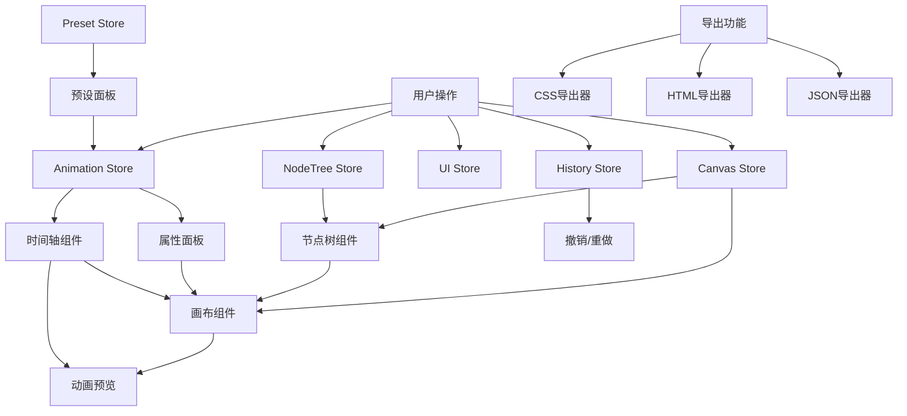

# CSS动画可视化编辑器开发计划

## 项目架构

### 技术栈

- **框架**: Vue 3 + TypeScript
- **构建工具**: Vite
- **UI库**: Naive UI
- **状态管理**: Pinia
- **代码规范**: ESLint + Prettier
- **样式方案**: CSS Modules / Scoped CSS
- **动画库**: 原生CSS + 自定义动画引擎
- **拖拽库**: 自定义实现（画布元素拖拽、布局调整）
- **贝塞尔曲线编辑器**: 自定义实现

### 项目结构

```
css-animation-editor/
├── src/
│   ├── components/          # 组件
│   │   ├── Canvas/          # 画布模块
│   │   ├── PropertyPanel/   # 右侧属性面板
│   │   ├── Timeline/        # 底部时间轴
│   │   ├── LeftSidebar/     # 左侧侧边栏容器
│   │   │   ├── NodeTree/    # 节点树面板
│   │   │   └── PresetPanel/ # 预设面板
│   │   ├── Header/          # 顶部Banner
│   │   └── common/          # 通用组件
│   ├── stores/              # Pinia状态管理
│   ├── types/               # TypeScript类型定义
│   ├── utils/               # 工具函数
│   ├── schemas/             # 预设Schema定义
│   ├── composables/         # Vue组合式函数
│   └── App.vue
├── .cursorrules             # AI规则文件
├── .cursor/                 # Cursor配置
│   └── memory-bank/         # Memory bank文件
└── package.json
```

## 核心模块设计

### 1. 中间画布模块 (`src/components/Canvas/`)

**功能**:

- 可视化编辑区域，支持元素拖拽、缩放、旋转
- 标尺系统（水平/垂直）
- 网格背景
- 实时预览动画效果
- 元素选择与多选

**关键文件**:

- `Canvas.vue`: 主画布组件
- `CanvasRuler.vue`: 标尺组件
- `CanvasElement.vue`: 画布元素组件
- `CanvasGrid.vue`: 网格背景

**数据结构**:

```typescript
interface CanvasElement {
  id: string;
  type: 'div' | 'span' | 'img' | 'custom';
  style: CSSProperties;
  animation: AnimationConfig;
  position: { x: number; y: number };
  size: { width: number; height: number };
}
```

**技术选项**:

- **渲染方案**: 使用原生DOM + CSS Transform（性能好，兼容性强）
- **拖拽库**: 自定义实现（基于mousedown/mousemove/mouseup事件）
- **选择框**: Canvas API绘制选择框，或使用div覆盖层
- **标尺**: SVG绘制标尺刻度，使用ResizeObserver监听画布尺寸
- **网格**: CSS background-image或Canvas绘制
- **动画预览**: CSS Animation API或Web Animations API
- **性能优化**: 使用requestAnimationFrame，元素懒渲染（视口外不渲染）

### 2. 右侧属性面板 (`src/components/PropertyPanel/`)

**功能**:

- 显示选中元素的属性
- 实时编辑属性值
- 支持所有CSS可动画属性
- 属性分组展示（Transform、Color、Layout等）

**关键文件**:

- `PropertyPanel.vue`: 主面板
- `PropertyGroup.vue`: 属性分组
- `PropertyInput.vue`: 属性输入组件

**属性分类**:

- Transform: translate, scale, rotate, skew
- Color: color, background-color, border-color
- Layout: width, height, margin, padding
- Effects: opacity, filter, box-shadow

**技术选项**:

- **输入组件**: Naive UI的Input、InputNumber、ColorPicker、Slider等
- **属性分组**: Naive UI的Collapse折叠面板
- **实时更新**: 使用watch监听输入变化，防抖处理（300ms）
- **数值解析**: 支持px、%、em、rem等单位，使用正则表达式解析
- **颜色选择**: Naive UI ColorPicker或自定义颜色选择器
- **联动更新**: 通过Pinia store实现属性与画布双向绑定

### 3. 底部时间轴模块 (`src/components/Timeline/`)

**功能**:

- 时间轴显示与播放控制
- 关键帧编辑（添加/删除/移动）
- 动画时长设置
- 自动K帧功能
- 分通道显示（每个属性一个通道）
- 贝塞尔曲线编辑器

**关键文件**:

- `Timeline.vue`: 主时间轴组件
- `TimelineTrack.vue`: 属性通道轨道
- `KeyframeEditor.vue`: 关键帧编辑器
- `BezierEditor.vue`: 贝塞尔曲线编辑器
- `PlaybackControls.vue`: 播放控制

**数据结构**:

```typescript
interface Keyframe {
  time: number; // 0-1 相对时间
  value: number | string;
  easing: BezierCurve;
}

interface AnimationTrack {
  property: string;
  keyframes: Keyframe[];
  duration: number;
}
```

**技术选项**:

- **时间轴渲染**: Canvas绘制时间轴刻度、关键帧、播放头
- **关键帧拖拽**: 使用mousedown事件，计算鼠标位置转换为时间
- **时间轴缩放**: 使用transform scale或重新计算像素到时间的映射
- **播放控制**: requestAnimationFrame + 时间戳计算当前帧
- **贝塞尔曲线**: Canvas绘制曲线，bezier-easing库计算缓动值
- **关键帧插值**: 线性插值或贝塞尔曲线插值算法
- **自动K帧**: 监听属性变化，自动在当前位置创建关键帧
- **分通道显示**: 虚拟滚动（@vueuse/core useVirtualList）优化性能

### 4. 左侧侧边栏 (`src/components/LeftSidebar/`)

左侧栏采用标签页（Tabs）设计，包含两个主要模块：

#### 4.1 节点树面板 (`src/components/NodeTree/`)

**功能**:

- 树形结构展示所有画布元素
- 支持元素层级关系（父子节点）
- 节点选择（点击节点选中画布对应元素）
- 节点重命名
- 节点展开/折叠
- 节点拖拽排序（调整层级）
- 节点删除
- 节点复制
- 节点搜索和过滤
- 节点图标显示（根据元素类型）
- 选中节点高亮
- 支持节点分组/文件夹

**关键文件**:

- `NodeTree.vue`: 节点树主组件
- `NodeTreeItem.vue`: 节点项组件
- `NodeTreeSearch.vue`: 节点搜索组件

**数据结构**:

```typescript
interface TreeNode {
  id: string;
  name: string;
  type: 'element' | 'group' | 'folder';
  elementId?: string; // 关联的画布元素ID
  children?: TreeNode[];
  expanded?: boolean;
  icon?: string;
  visible?: boolean;
  locked?: boolean;
}
```

**交互功能**:

- 点击节点：选中画布对应元素
- 双击节点：重命名
- 右键菜单：复制、删除、锁定、隐藏等
- 拖拽节点：调整层级顺序
- 拖拽到画布：创建新元素

**技术选项**:

- **树形组件**: Naive UI的Tree组件，或自定义递归组件
- **拖拽排序**: 使用HTML5 Drag & Drop API或自定义拖拽实现
- **搜索过滤**: 使用computed计算属性，支持模糊搜索
- **虚拟滚动**: 大量节点时使用@vueuse/core useVirtualList
- **节点图标**: 使用Naive UI的Icon组件或自定义SVG图标
- **右键菜单**: Naive UI的Dropdown或自定义ContextMenu组件
- **双向绑定**: 通过Pinia store同步节点树和画布元素状态

#### 4.2 预设面板 (`src/components/PresetPanel/`)

**功能**:

- 预设动画列表展示
- 预设分类
- 预设预览
- 导入/导出预设（JSON格式）
- 自定义预设Schema
- 预设搜索和筛选

**关键文件**:

- `PresetPanel.vue`: 预设面板
- `PresetCard.vue`: 预设卡片
- `PresetImporter.vue`: 预设导入器
- `PresetCategory.vue`: 预设分类

**Schema定义** (`src/schemas/preset.schema.ts`):

```typescript
interface PresetSchema {
  name: string;
  category: string;
  description?: string;
  animation: AnimationConfig;
  preview?: string; // 预览图URL
  tags?: string[];
}
```

**左侧栏布局**:

- 使用Naive UI的Tabs组件
- 标签1: 节点树（Node Tree）
- 标签2: 预设库（Presets）
- 支持标签页切换
- 支持标签页宽度调整

**技术选项**:

- **预设存储**: LocalStorage + JSON格式，或IndexedDB（大量预设时）
- **预设预览**: 使用Canvas录制GIF，或使用CSS动画实时预览
- **分类管理**: Naive UI的Tabs或Menu组件实现分类切换
- **搜索过滤**: computed计算属性 + 标签匹配
- **导入导出**: FileReader API读取文件，file-saver库导出JSON
- **预设应用**: 拖拽到画布或点击应用，通过Pinia store更新动画配置
- **虚拟滚动**: 大量预设时使用@vueuse/core useVirtualList优化性能

### 5. 顶部Banner (`src/components/Header/`)

**功能**:

- 主题切换（亮色/暗色）
- 设置按钮
- 全局设置面板（导出格式、默认时长等）

**关键文件**:

- `Header.vue`: 顶部Banner
- `SettingsModal.vue`: 设置弹窗
- `ThemeToggle.vue`: 主题切换

**技术选项**:

- **主题切换**: Naive UI的useTheme或自定义CSS变量切换
- **设置弹窗**: Naive UI的Modal组件
- **设置存储**: LocalStorage持久化用户设置
- **主题持久化**: 使用localStorage保存主题偏好

### 6. 状态管理 (`src/stores/`)

**技术选项**:

- **状态管理**: Pinia（Vue3官方推荐）
- **状态持久化**: pinia-plugin-persistedstate或手动LocalStorage
- **状态分片**: 按功能模块拆分store（canvas、animation、ui等）
- **计算属性**: 使用getters处理派生状态
- **异步操作**: 使用actions处理异步逻辑
- **状态订阅**: 使用watch监听状态变化，实现模块间通信

**核心Store**:

- `canvasStore.ts`: 画布状态（元素列表、选中元素、画布配置）
- `animationStore.ts`: 动画状态（时间轴、播放状态、关键帧）
- `nodeTreeStore.ts`: 节点树状态（节点树结构、选中节点、展开状态）
- `presetStore.ts`: 预设管理
- `uiStore.ts`: UI状态（主题、布局尺寸、设置、左侧栏当前标签页）

### 7. 布局系统

**功能**:

- 可拖拽调整布局边缘
- 响应式布局
- 布局配置持久化

**实现**:

- 使用自定义拖拽手柄
- 监听resize事件
- 使用CSS Grid或Flexbox布局

**技术选项**:

- **布局方案**: CSS Grid布局（推荐）或Flexbox
- **拖拽手柄**: 自定义div作为拖拽区域，监听mousedown/mousemove/mouseup
- **尺寸计算**: 使用ResizeObserver监听容器尺寸变化
- **布局持久化**: LocalStorage保存布局配置（面板宽度、高度）
- **响应式**: 使用CSS媒体查询或JavaScript监听窗口resize
- **拖拽反馈**: 使用CSS cursor和视觉反馈（拖拽时显示尺寸提示）

## 增强功能模块

### 8. 撤销/重做系统 (`src/stores/historyStore.ts`)

**功能**:

- 操作历史记录（最多50步）
- 撤销/重做快捷键支持
- 历史记录可视化
- 操作合并（连续相同操作合并为一步）

**实现**:

- 使用命令模式记录操作
- 深拷贝状态快照
- 内存优化（限制历史记录数量）

**技术选项**:

- **历史记录**: 使用数组存储状态快照，限制最大数量（50步）
- **深拷贝**: 使用structuredClone（现代浏览器）或lodash cloneDeep
- **命令模式**: 每个操作封装为Command对象（execute/undo方法）
- **内存优化**: 使用WeakMap存储大对象，或使用序列化/反序列化
- **操作合并**: 相同类型操作在短时间内合并为一步（防抖）

### 9. 快捷键系统 (`src/composables/useKeyboardShortcuts.ts`)

**快捷键列表**:

- `Ctrl/Cmd + Z`: 撤销
- `Ctrl/Cmd + Shift + Z`: 重做
- `Ctrl/Cmd + C`: 复制元素
- `Ctrl/Cmd + V`: 粘贴元素
- `Ctrl/Cmd + D`: 复制并粘贴
- `Delete/Backspace`: 删除选中元素
- `Space`: 播放/暂停动画
- `Ctrl/Cmd + S`: 保存项目
- `Ctrl/Cmd + O`: 打开项目
- `Ctrl/Cmd + E`: 导出代码
- `Ctrl/Cmd + +/-`: 缩放画布
- `Ctrl/Cmd + 0`: 重置缩放
- `G`: 切换网格显示
- `R`: 切换标尺显示

**技术选项**:

- **事件监听**: 使用@vueuse/core的useKeyboardShortcut或原生addEventListener
- **快捷键注册**: 使用Map存储快捷键和回调函数映射
- **修饰键检测**: 检测Ctrl/Cmd/Shift/Alt组合键
- **快捷键冲突**: 检查快捷键是否已被占用，提供冲突提示
- **快捷键提示**: 在UI上显示快捷键提示（Tooltip或快捷键面板）

### 10. 图层管理面板 (`src/components/LayerPanel/`)

**功能**:

- 显示所有画布元素列表
- 图层顺序调整（拖拽排序）
- 图层显示/隐藏切换
- 图层锁定
- 图层重命名
- 图层分组

**关键文件**:

- `LayerPanel.vue`: 图层面板
- `LayerItem.vue`: 图层项组件

### 11. 对齐辅助系统 (`src/components/Canvas/CanvasGuides.vue`)

**功能**:

- 智能对齐线（元素对齐时显示）
- 元素间距显示
- 中心对齐提示
- 网格对齐（吸附到网格）
- 元素对齐（吸附到其他元素边缘）

**技术选项**:

- **对齐线绘制**: Canvas或SVG绘制对齐线，或使用div覆盖层
- **对齐检测**: 计算元素边界框，检测与其他元素的距离（阈值5px）
- **吸附算法**: 拖拽时检测是否接近网格点或其他元素边缘，自动吸附
- **间距计算**: 计算元素之间的水平和垂直距离
- **性能优化**: 使用节流处理对齐检测（避免频繁计算）

### 12. 多元素支持增强

**功能**:

- 多选元素（框选、Ctrl点击）
- 批量编辑属性
- 元素组合/解组
- 元素复制/粘贴
- 元素对齐工具（左对齐、居中对齐等）
- 元素分布工具（等间距分布）

### 13. 动画序列系统 (`src/stores/sequenceStore.ts`)

**功能**:

- 多个动画序列管理
- 动画延迟设置
- 动画播放顺序（顺序/并行/交错）
- 动画循环设置（次数、无限循环）
- 动画方向（正向/反向/交替）

**数据结构**:

```typescript
interface AnimationSequence {
  id: string;
  name: string;
  animations: string[]; // 动画ID列表
  playMode: 'sequential' | 'parallel' | 'stagger';
  staggerDelay?: number;
  iterations: number | 'infinite';
  direction: 'normal' | 'reverse' | 'alternate';
}
```

### 14. 缓动函数库 (`src/utils/easingLibrary.ts`)

**功能**:

- 内置常用缓动函数（ease-in, ease-out, ease-in-out等）
- 缓动函数预览
- 自定义缓动函数保存
- 缓动函数分类（弹性、弹跳、平滑等）

**实现**:

- 提供预设贝塞尔曲线值
- 缓动函数可视化预览

**技术选项**:

- **缓动函数库**: bezier-easing库计算缓动值，或自定义实现
- **预设曲线**: 提供常用缓动函数（ease、ease-in、ease-out等）的贝塞尔参数
- **可视化预览**: Canvas绘制缓动曲线图，实时预览效果
- **自定义保存**: LocalStorage保存用户自定义缓动函数

### 15. 动画性能分析 (`src/components/PerformanceMonitor/`)

**功能**:

- FPS监控
- 动画性能评分
- 性能优化建议
- 重绘区域高亮（开发模式）
- 动画复杂度分析

**技术选项**:

- **FPS监控**: 使用requestAnimationFrame计算帧率
- **性能API**: Performance API（performance.now()）测量动画性能
- **重绘检测**: Chrome DevTools的Paint Flashing或自定义实现
- **性能评分**: 基于FPS、CPU使用率、内存占用计算评分
- **优化建议**: 基于性能数据提供优化建议（减少关键帧、简化动画等）

### 16. 响应式预览 (`src/components/ResponsivePreview/`)

**功能**:

- 预设设备尺寸（手机、平板、桌面）
- 自定义视口尺寸
- 多设备同时预览
- 响应式断点设置

**技术选项**:

- **设备预设**: 预定义常见设备尺寸（iPhone、iPad、Desktop等）
- **视口调整**: 使用CSS transform scale缩放画布，或使用iframe
- **多设备预览**: 使用多个iframe或Canvas同时渲染不同尺寸
- **断点管理**: 使用CSS媒体查询或JavaScript监听窗口尺寸

### 17. 项目管理系统 (`src/stores/projectStore.ts`)

**功能**:

- 项目保存到LocalStorage
- 项目导出为JSON文件
- 项目导入
- 项目模板
- 最近打开项目列表
- 项目重命名
- 项目缩略图生成

**技术选项**:

- **存储方案**: LocalStorage（小项目）或IndexedDB（大项目，支持更大存储）
- **项目格式**: JSON格式，包含版本号、元数据、所有元素和动画数据
- **文件操作**: FileReader API读取文件，file-saver库导出
- **缩略图**: Canvas截图生成缩略图（html2canvas库）
- **项目列表**: LocalStorage存储项目列表，支持最近打开、收藏等
- **版本控制**: JSON中包含版本号，支持向后兼容

### 18. 代码编辑器增强 (`src/components/CodeEditor/`)

**功能**:

- 代码高亮（使用Monaco Editor或CodeMirror）
- 代码格式化
- 代码实时预览
- 代码片段收藏
- 代码模板
- 语法检查

**技术选项**:

- **编辑器选择**: Monaco Editor（VS Code编辑器，功能强大但体积大）或CodeMirror（轻量）
- **语法高亮**: Monaco内置CSS/HTML/JS语法高亮
- **代码格式化**: prettier格式化CSS/HTML代码
- **实时预览**: iframe预览或使用Web Components
- **代码片段**: LocalStorage保存用户代码片段
- **语法检查**: 使用CSS/HTML linter（如stylelint、htmlhint）

### 19. 路径动画支持 (`src/components/Canvas/PathAnimation.vue`)

**功能**:

- SVG路径绘制
- 元素沿路径移动
- 路径编辑器
- 路径预览

### 20. 3D变换支持

**功能**:

- 3D旋转（rotateX, rotateY, rotateZ）
- 3D透视（perspective）
- 3D变换预览
- 3D视图切换

### 21. 动画事件系统 (`src/stores/eventStore.ts`)

**功能**:

- 动画开始/结束事件
- 关键帧事件回调
- 动画暂停/恢复事件
- 自定义事件触发器

### 22. 导出增强功能

**导出格式扩展**:

1. **CSS代码** (`src/utils/exporters/cssExporter.ts`):

   - 生成 `@keyframes` 规则
   - 生成 `animation` 属性
   - 支持所有动画属性
   - 代码压缩选项
   - 代码注释选项

2. **CSS+HTML完整代码** (`src/utils/exporters/fullExporter.ts`):

   - 包含完整HTML结构
   - 内联或外部CSS
   - 可直接运行
   - 响应式代码生成

3. **JSON格式** (`src/utils/exporters/jsonExporter.ts`):

   - 导出项目配置
   - 包含所有元素和动画数据
   - 支持导入恢复
   - 版本控制支持

4. **视频/GIF导出** (`src/utils/exporters/mediaExporter.ts`):

   - 使用Canvas录制动画
   - 导出为MP4视频
   - 导出为GIF动图
   - 分辨率设置
   - 帧率设置

5. **React/Vue组件导出** (`src/utils/exporters/componentExporter.ts`):

   - 导出为React组件
   - 导出为Vue组件
   - 支持Props配置

**技术选项**:

- **CSS代码生成**: 模板字符串拼接，或使用代码生成库（如prettier格式化）
- **代码格式化**: prettier库格式化CSS/HTML代码
- **代码压缩**: 使用cssnano或自定义压缩逻辑
- **文件导出**: file-saver库导出文件，或使用Blob API
- **JSON序列化**: JSON.stringify，支持版本号和元数据
- **视频/GIF导出**: 
  - Canvas录制：使用Canvas API + MediaRecorder API
  - GIF生成：使用gif.js或gifshot库
  - 视频编码：使用MediaRecorder API（MP4需要编码器支持）
- **代码编辑器**: Monaco Editor（VS Code编辑器）集成，支持语法高亮
- **模板引擎**: 使用模板字符串或模板引擎（如Handlebars）生成代码

## UI/UX增强功能

### 23. 工具栏系统 (`src/components/Toolbar/`)

**功能**:

- 选择工具
- 移动工具
- 旋转工具
- 缩放工具
- 文本工具
- 形状工具（矩形、圆形等）
- 工具提示和快捷键显示

### 24. 上下文菜单 (`src/components/ContextMenu/`)

**功能**:

- 右键菜单
- 元素操作菜单（复制、删除、锁定等）
- 时间轴右键菜单（添加关键帧、删除等）
- 画布右键菜单（粘贴、全选等）

### 25. 搜索功能 (`src/components/SearchPanel/`)

**功能**:

- 全局搜索（元素、预设、属性）
- 快速跳转到元素
- 搜索历史

### 26. 提示和引导系统

**功能**:

- 首次使用引导（Tour）
- 功能提示（Tooltip）
- 操作提示（Toast）
- 帮助文档链接

### 27. 拖拽增强

**功能**:

- 从预设面板拖拽应用到元素
- 从属性面板拖拽数值调整
- 拖拽调整时间轴关键帧位置
- 拖拽调整贝塞尔曲线控制点

## 性能优化

### 28. 虚拟滚动 (`src/composables/useVirtualScroll.ts`)

**应用场景**:

- 预设列表（大量预设时）
- 图层列表（大量元素时）
- 时间轴轨道（大量关键帧时）
- 节点树（大量节点时）

**技术选项**:

- **虚拟滚动库**: @vueuse/core的useVirtualList
- **实现原理**: 只渲染可见区域的元素，动态计算滚动位置
- **性能优化**: 使用IntersectionObserver检测可见性

### 29. 画布性能优化

**优化策略**:

- 元素懒渲染（视口外元素不渲染）
- Canvas离屏渲染
- 动画预览时降低非关键元素渲染质量
- 防抖/节流处理频繁更新

**技术选项**:

- **懒渲染**: 使用IntersectionObserver检测元素是否在视口内
- **离屏Canvas**: 使用OffscreenCanvas（支持时）或隐藏Canvas预渲染
- **防抖节流**: @vueuse/core的useDebounce和useThrottle
- **requestAnimationFrame**: 使用RAF优化动画更新
- **Web Workers**: 复杂计算移到Worker线程（可选）

### 30. 状态管理优化

**优化策略**:

- 状态分片（按模块拆分）
- 计算属性缓存
- 状态更新批处理
- 使用Proxy优化深层响应式

**技术选项**:

- **状态分片**: Pinia按功能模块拆分store
- **计算属性**: 使用getters缓存计算结果
- **批处理**: 使用nextTick批量更新DOM
- **浅层响应**: 避免深层嵌套对象，使用扁平化数据结构

## 可访问性支持

### 31. 无障碍功能

**功能**:

- 键盘导航支持
- ARIA标签
- 屏幕阅读器支持
- 高对比度模式
- 字体大小调整
- 焦点管理

## 开发工具增强

### 32. 调试工具 (`src/components/DevTools/`)

**功能**:

- 动画时间轴可视化
- 元素边界框显示
- 动画值实时监控
- 性能分析面板
- 状态查看器

### 33. 测试支持

**功能**:

- 单元测试框架（Vitest）
- 组件测试
- E2E测试（Playwright）
- 视觉回归测试

## 协作功能（可选，未来扩展）

### 34. 分享功能

**功能**:

- 生成分享链接
- 项目预览页面
- 嵌入代码生成
- 二维码分享

### 35. 版本控制

**功能**:

- 项目版本历史
- 版本对比
- 版本回滚
- 变更记录

## AI维护系统

### Memory Bank结构 (`.cursor/memory-bank/`)

1. **项目架构说明** (`architecture.md`):

   - 项目结构说明
   - 核心模块职责
   - 数据流图
   - 模块依赖关系

2. **开发规范** (`conventions.md`):

   - 命名规范
   - 组件规范
   - 代码风格
   - Git提交规范

3. **关键决策记录** (`decisions.md`):

   - 技术选型原因
   - 架构决策
   - 性能优化决策

4. **API文档** (`api.md`):

   - Store API
   - 工具函数API
   - 组件Props API

5. **常见问题** (`faq.md`):

   - 开发常见问题
   - 调试技巧
   - 性能优化技巧

### Cursor Rules (`.cursorrules`)

包含：

- 项目技术栈说明
- 代码风格要求
- 组件开发规范
- 常用工具函数位置
- 文件命名规范
- 导入路径规范
- 类型定义规范

## 开发步骤（分阶段实施，MVP优先）

### Phase 1: 项目初始化与基础架构

1. 初始化Vite + Vue3 + TypeScript项目
2. 配置ESLint + Prettier + Husky（Git hooks）
3. 安装Naive UI及相关依赖
4. 配置项目基础结构
5. 创建AI维护文件（.cursorrules, memory-bank）
6. 设置Pinia状态管理基础结构
7. 配置路径别名和基础工具函数

### Phase 2: 核心布局系统

1. 实现可调整布局系统（拖拽边缘）
2. 创建顶部Banner和主题切换
3. 创建左侧/右侧/底部面板框架
4. 实现布局持久化（LocalStorage）
5. 实现响应式布局适配

### Phase 3: 画布模块（核心功能）

1. 实现画布基础（网格、标尺）
2. 实现元素渲染和选择（单选）
3. 实现元素拖拽和变换
4. 实现多选和框选
5. 实现对齐辅助线
6. 实现动画预览
7. 实现画布缩放和平移

### Phase 4: 属性面板

1. 实现属性列表展示（分组）
2. 实现属性编辑输入（各种输入类型）
3. 实现属性与画布实时联动
4. 支持所有动画属性
5. 实现批量编辑（多选时）

### Phase 5: 时间轴模块（核心功能）

1. 实现时间轴UI和播放控制
2. 实现关键帧添加/编辑/删除
3. 实现分通道显示（每个属性一个通道）
4. 实现时间轴缩放和滚动
5. 实现贝塞尔曲线编辑器
6. 实现自动K帧功能
7. 实现动画播放控制（播放、暂停、循环等）

### Phase 6: 节点树系统

1. 实现节点树基础结构（树形组件）
2. 实现节点与画布元素的双向绑定
3. 实现节点选择和高亮
4. 实现节点展开/折叠
5. 实现节点重命名
6. 实现节点拖拽排序
7. 实现节点搜索和过滤
8. 实现节点右键菜单
9. 实现节点分组/文件夹功能

### Phase 7: 预设系统

1. 定义预设Schema
2. 实现预设列表和分类
3. 实现预设预览
4. 实现预设导入/导出
5. 创建默认预设库（20+常用动画）
6. 实现预设搜索和筛选
7. 实现左侧栏标签页切换（节点树/预设库）

### Phase 8: 撤销/重做与快捷键

1. 实现操作历史记录系统
2. 实现撤销/重做功能
3. 实现全局快捷键系统
4. 添加快捷键提示

### Phase 9: 图层管理

1. 实现图层列表显示
2. 实现图层顺序调整
3. 实现图层显示/隐藏/锁定
4. 实现图层分组
5. 图层管理与节点树联动

### Phase 10: 导出功能

1. 实现CSS导出（基础）
2. 实现CSS+HTML导出
3. 实现JSON导出/导入
4. 实现代码编辑器（Monaco Editor）
5. 实现代码格式化

### Phase 11: 动画序列与高级功能

1. 实现动画序列管理
2. 实现缓动函数库
3. 实现3D变换支持
4. 实现路径动画（可选）

### Phase 12: 项目管理系统

1. 实现项目保存/加载（LocalStorage）
2. 实现项目导入/导出
3. 实现最近项目列表
4. 实现项目模板

### Phase 13: 性能优化

1. 实现虚拟滚动（预设列表、图层列表、节点树）
2. 优化画布渲染性能
3. 优化状态管理性能
4. 实现懒加载

### Phase 14: UI/UX增强

1. 实现工具栏系统
2. 实现上下文菜单
3. 实现搜索功能
4. 实现提示和引导系统
5. 实现响应式预览

### Phase 15: 可访问性与完善

1. 实现无障碍功能
2. 实现调试工具
3. 错误处理和边界情况
4. 性能监控
5. 文档完善
6. 单元测试和E2E测试

### Phase 16: 高级导出（可选）

1. 实现视频/GIF导出（使用Canvas录制）
2. 实现React/Vue组件导出
3. 实现代码压缩和优化选项

## 关键技术点

1. **贝塞尔曲线编辑器**: 自定义Canvas实现，支持拖拽控制点，实时预览曲线效果
2. **时间轴缩放**: 支持时间轴缩放（鼠标滚轮），精确编辑关键帧，支持毫秒级精度
3. **动画插值**: 实现关键帧之间的值插值计算（线性、贝塞尔曲线插值）
4. **实时预览**: 使用CSS动画或Web Animations API，支持暂停、跳转、循环
5. **布局调整**: 使用ResizeObserver和拖拽事件，支持边缘拖拽调整面板大小
6. **虚拟滚动**: 使用@vueuse/core的useVirtualList实现大列表性能优化
7. **状态管理**: Pinia模块化设计，支持状态持久化和时间旅行调试
8. **动画引擎**: 自定义动画计算引擎，支持复杂动画序列和事件系统
9. **代码生成**: 智能CSS代码生成，支持代码压缩、格式化、注释选项
10. **性能监控**: 使用Performance API监控动画性能，提供优化建议

## 依赖包

```json
{
  "dependencies": {
    "vue": "^3.4.0",
    "naive-ui": "^2.38.0",
    "pinia": "^2.1.0",
    "@vueuse/core": "^10.7.0",
    "monaco-editor": "^0.45.0",
    "bezier-easing": "^2.1.0",
    "file-saver": "^2.0.5"
  },
  "devDependencies": {
    "@typescript-eslint/eslint-plugin": "^6.0.0",
    "@typescript-eslint/parser": "^6.0.0",
    "eslint": "^8.57.0",
    "eslint-plugin-vue": "^9.20.0",
    "prettier": "^3.2.0",
    "typescript": "^5.3.0",
    "vite": "^5.0.0",
    "@vitejs/plugin-vue": "^5.0.0",
    "husky": "^8.0.3",
    "lint-staged": "^15.2.0",
    "vitest": "^1.2.0",
    "@vue/test-utils": "^2.4.5",
    "playwright": "^1.41.0"
  }
}
```

## 数据流架构



## MVP功能清单（最小可行产品）

### 核心功能（必须）

- [x] 画布基础功能（网格、标尺、元素选择）
- [x] 元素拖拽和变换
- [x] 属性面板编辑
- [x] 时间轴基础功能（播放、关键帧）
- [x] 基础预设库
- [x] CSS导出

### 重要功能（高优先级）

- [ ] 节点树（元素树形结构展示和管理）
- [ ] 撤销/重做
- [ ] 快捷键支持
- [ ] 图层管理
- [ ] 多选和批量编辑
- [ ] 对齐辅助线
- [ ] 贝塞尔曲线编辑器
- [ ] JSON导入/导出

### 增强功能（中优先级）

- [ ] 动画序列
- [ ] 缓动函数库
- [ ] 代码编辑器
- [ ] 项目保存/加载
- [ ] 响应式预览

### 高级功能（低优先级）

- [ ] 3D变换
- [ ] 路径动画
- [ ] 视频/GIF导出
- [ ] 性能分析
- [ ] 分享功能